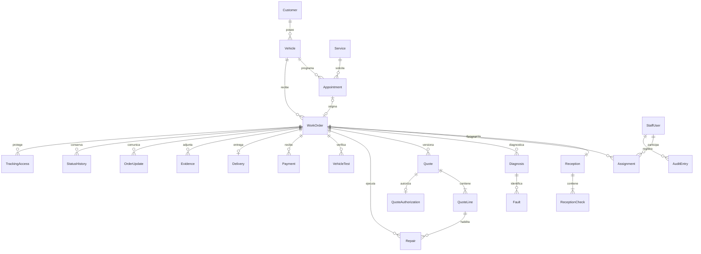

# Decisiones de implementación

Los documentos funcional y preliminar se interpretaron como requisitos del producto. La planeación de seguridad es la revisión más reciente y define el alcance del portal y las versiones. Las indicaciones de “próximo entregable” dentro de los documentos se trataron como antecedentes de planeación; la solicitud actual autoriza implementar el sistema.

## Alcance concretado

| Documento / necesidad | Implementación |
| --- | --- |
| ASP.NET Core, C#, REST, EF y SQL Server | Proyecto web .NET 8 integrado en la solución original |
| Personal y roles | Identity, contraseñas con hash, bloqueo por intentos, cookie HttpOnly, validación de usuario activo y sello de seguridad en cada petición |
| Clientes, vehículos, servicios | Alta y edición con desactivación lógica; relaciones históricas conservadas |
| Agenda | Citas ligadas al vehículo y servicio, validación de solapamientos del mismo vehículo, conversión a recepción |
| Recepción | Combustible, kilometraje, llaves, accesorios, pertenencias, daños y checklist |
| Órdenes | Máquina de estados, responsable de recepción, asignaciones, fechas, prioridad e historial |
| Diagnóstico | Hallazgos, causa, recomendación y fallas con prioridad |
| Cotización | Conceptos, descuento global, impuesto, vencimiento y versiones inmutables de importes/conceptos |
| Consentimiento | Aprobación o rechazo completo registrado por el personal, con constancia textual; adjuntos disponibles en evidencias |
| Reparación | Trabajo vinculado a un concepto de la última cotización autorizada, autor y fecha de terminación |
| Pruebas | Resultado y observaciones; fallo devuelve a reparación; prueba satisfactoria posterior al trabajo requerida para finalizar |
| Pagos | Registro manual parcial/total, sin pasarela de cobro; saldo y control contra sobrepagos |
| Entrega | Saldo, prueba, kilometraje y conformidad; cierre histórico de la orden |
| Archivos | JPEG, PNG y PDF en almacenamiento privado, firma de tipo y tamaño máximo, acceso autorizado en cada descarga |
| Seguimiento | QR aleatorio, folio más código, hash SHA-256 de secretos aleatorios de alta entropía, vencimiento y revocación |
| Auditoría | Usuario, operación, registro y fecha; las operaciones de órdenes y bitácora se guardan en una transacción |
| Bootstrap propuesto | Se utilizó CSS propio y JavaScript nativo local para evitar dependencias de interfaz externas |

## Permisos

| Operación | Administrador | Recepción | Mecánico |
| --- | --- | --- | --- |
| Clientes, vehículos, servicios, citas | Sí | Sí | No |
| Consultar órdenes | Todas | Todas | Solo asignadas y vigentes |
| Recibir, asignar, cotizar, registrar consentimiento | Sí | Sí | No |
| Diagnósticos, trabajos, pruebas, evidencias, actualizaciones | Sí | Sí | Solo en sus órdenes |
| Cambiar estados | Transiciones válidas | Transiciones válidas | Diagnóstico, reparación, pruebas y reparado |
| Pagos, entrega, regenerar/revocar seguimiento | Sí | Sí | No |
| Usuarios y auditoría | Sí | No | No |
| Cambiar contraseña propia | Sí | Sí | Sí |

El portal no comparte la sesión del personal. La credencial resuelve la orden en el servidor; el navegador no puede elegir otro identificador. En el portal no se devuelve el cliente, diagnóstico técnico, bitácora, notas internas ni nombres del personal. Los diagnósticos se comunican mediante actualizaciones explícitamente públicas. Se muestra la cotización más reciente y únicamente las evidencias públicas.

## Integridad y simplificaciones del modelo

- ASP.NET Core Identity proporciona usuarios y roles en sus tablas estándar `AspNet*`.
- Los estados, prioridades y resultados se representan con enumeraciones tipadas y validadas en la API; no son catálogos editables en esta versión.
- Cita y orden derivan su cliente del vehículo para evitar claves redundantes inconsistentes. El cambio de propietario no está habilitado: necesita un procedimiento que conserve la titularidad histórica.
- VIN opcional con índice único filtrado; folio único independiente del identificador; una cita solo puede recibirse una vez; una sola recepción y entrega por orden.
- Las FK usan `Restrict`. Se conservan cotizaciones, consentimientos, pagos, archivos y bitácoras; no se exponen eliminaciones físicas.
- Transacciones serializables para recepción, cambios de órdenes y creación de citas; `rowversion` para órdenes. Los pagos se comprueban dentro de la transacción para impedir cobros simultáneos superiores al saldo.
- Una nueva cotización es una propuesta completa sustitutiva. No es una suma automática de ampliaciones. La versión previamente autorizada permanece intacta; el saldo se calcula sobre la última autorizada y todos los pagos recibidos. La nueva propuesta no puede ser menor que lo ya pagado.
- Solo se permiten trabajos contra conceptos de la última versión autorizada. Todos sus conceptos deben tener un trabajo terminado antes de las pruebas. No hay aprobación parcial ni dependencias entre conceptos en este MVP.
- Cada autorización se vincula a una versión exacta. El cliente se deriva del vehículo. No se habilita firma o aprobación digital en el portal.
- Las fotografías y constancias se adjuntan después de crear la orden para que toda evidencia tenga una orden y permisos verificables.
- CHECK para montos, kilometraje, combustible, años, fechas de citas y totales. Las reglas del proceso están en los servicios; no se deben modificar registros operativos mediante SQL directo.
- El checklist inicial tiene cinco elementos editables en la recepción y se conserva como instantánea histórica. No tiene editor de catálogo independiente.

## Valores iniciales pendientes de validación del negocio

Seguimiento por 90 días desde emisión y como máximo 7 días tras la entrega, sesiones del portal de una hora, bloqueo del código tras cinco fallos durante 15 minutos y límite de 20 intentos por IP/minuto en rutas de credenciales. Cookies del personal por ocho horas. Contraseña mínima de 12 caracteres con complejidad de Identity; bloqueo del personal tras cinco fallos por 15 minutos.

Los importes usan dos decimales y redondeo AwayFromZero. La moneda inicial es GTQ y el impuesto sugerido es 0%; ambos son configurables. El pago completo es requisito de entrega por defecto. Las fechas se muestran en la zona local del navegador.

## Evolución

La base sirve para operación local de un taller. Las listas todavía no usan paginación del servidor, la configuración se administra mediante archivos/entorno y la recuperación de contraseña requiere una siguiente implementación de administración o correo. No se incluyeron catálogo normalizado de marcas/modelos, notificaciones, detalle de autorización parcial ni entidades de inventario porque pertenecen a versiones posteriores.

Para desplegar en varias instancias se requieren claves de protección compartidas, un almacén común de evidencias y límites de intentos distribuidos. La configuración local de certificados y LocalDB es exclusiva de desarrollo.

## Relaciones principales

